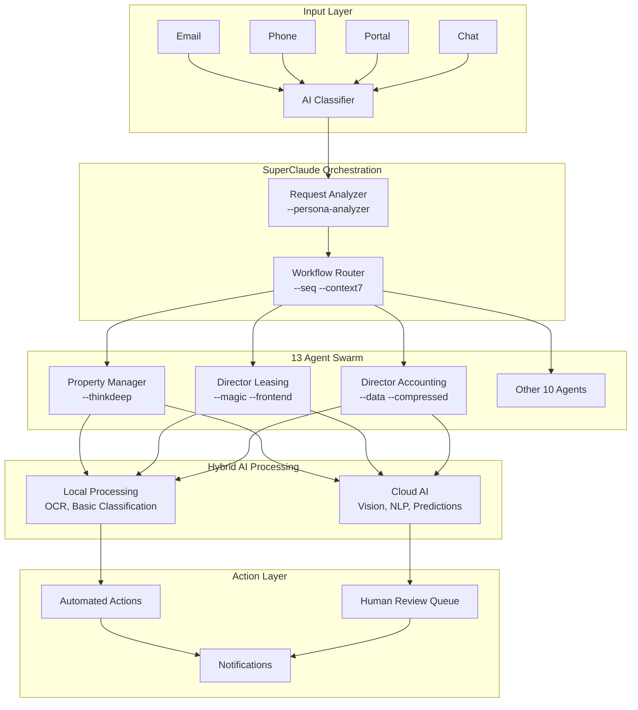

# Aictive Platform v2 - Master Implementation Guide
## Complete Integration: 13 Roles + SuperClaude + Hybrid AI + MCP Tools

### 🚀 Overview

This guide combines:
- **13 Property Management Roles** from your system manuals
- **SuperClaude Capabilities** (18 commands, 9 personas, 4 MCP servers)
- **Hybrid AI Approach** (local + cloud processing)
- **All Available Tools** (Task, Bash, Read, Edit, etc.)

## 🏗️ System Architecture



## 📋 Role-to-AI Mapping

### Executive Level (Strategic AI)
```yaml
president:
  superclaude_config:
    primary_persona: architect
    commands: [ultrathink, context]
    mcp_servers: [context7, sequential]
  ai_capabilities:
    - business_strategy_analysis
    - market_trend_prediction
    - portfolio_optimization
  decision_authority: maximum
  human_oversight: minimal

vp_operations:
  superclaude_config:
    primary_persona: devops
    secondary_persona: architect
    commands: [ultrathink, seq, thinkdeep]
    mcp_servers: [sequential, context7]
  ai_capabilities:
    - process_optimization
    - team_performance_analytics
    - compliance_monitoring

vp_property_management:
  superclaude_config:
    primary_persona: architect
    commands: [ultrathink, thinkdeep]
    mcp_servers: [context7]
  ai_capabilities:
    - vendor_performance_analysis
    - property_portfolio_health
    - strategic_planning
```

### Management Level (Operational AI)
```yaml
property_manager:
  superclaude_config:
    primary_persona: analyzer
    commands: [thinkdeep, context, seq]
    mcp_servers: [context7, sequential]
  ai_capabilities:
    vision:
      - damage_assessment (OpenAI Vision)
      - property_condition_monitoring
      - security_deposit_comparison
    nlp:
      - tenant_communication (Claude)
      - owner_reporting
      - lease_violation_detection
    predictive:
      - maintenance_forecasting
      - tenant_satisfaction_prediction
  automation_level: 85%

director_leasing:
  superclaude_config:
    primary_persona: frontend
    secondary_persona: data
    commands: [magic, seq, compressed]
    mcp_servers: [magic, context7]
  ai_capabilities:
    - lead_scoring_ml
    - virtual_tour_generation
    - application_auto_screening
    - dynamic_pricing_optimization
  automation_level: 80%

director_accounting:
  superclaude_config:
    primary_persona: data
    secondary_persona: security
    commands: [thinkdeep, compressed, thinksec]
    mcp_servers: [sequential]
  ai_capabilities:
    - payment_reconciliation
    - fraud_detection
    - financial_forecasting
    - automated_reporting
  automation_level: 90%
```

### Operational Level (Task AI)
```yaml
leasing_consultant:
  superclaude_config:
    primary_persona: teacher
    secondary_persona: frontend
    commands: [magic, context]
    mcp_servers: [magic]
  ai_capabilities:
    - chatbot_responses
    - showing_optimization
    - lead_nurturing
  automation_level: 75%

resident_services_coordinator:
  superclaude_config:
    primary_persona: frontend
    commands: [seq, context]
    mcp_servers: [context7]
  ai_capabilities:
    - renewal_prediction
    - satisfaction_monitoring
    - move_coordination
  automation_level: 80%

# ... Additional 8 roles with similar configurations
```

## 🔄 Workflow Implementation

### Example: Complete Maintenance Request Flow

```python
# 1. REQUEST INTAKE (Multiple Channels)
async def intake_maintenance_request(request_data):
    # Use SuperClaude analyzer to understand request
    analysis = await superclaude.analyze(
        data=request_data,
        persona="analyzer",
        command="thinkdeep",
        mcp=["context7"]
    )
    
    # Extract multimodal data
    if request_data.get("channel") == "voice":
        transcript = await ai_service.transcribe_audio(request_data["audio"])
        sentiment = await ai_service.analyze_sentiment(transcript)
    
    if request_data.get("images"):
        damage_analysis = await ai_service.assess_damage(request_data["images"])
        
    return {
        "urgency": analysis["urgency_score"],
        "category": analysis["maintenance_type"],
        "estimated_cost": damage_analysis.get("cost_estimate"),
        "tenant_sentiment": sentiment
    }

# 2. WORKFLOW ROUTING
async def route_maintenance_workflow(intake_result):
    if intake_result["urgency"] > 0.8:
        return "emergency_workflow"
    elif intake_result["estimated_cost"] > 500:
        return "major_repair_workflow"
    else:
        return "standard_maintenance_workflow"

# 3. AGENT COORDINATION
async def execute_maintenance_workflow(workflow_type, data):
    workflow = {
        "emergency_workflow": [
            ("property_manager", "immediate_response"),
            ("maintenance_coordinator", "emergency_dispatch"),
            ("accounts_payable", "expedited_payment"),
            ("property_manager", "owner_notification")
        ],
        "standard_maintenance_workflow": [
            ("property_manager", "intake_review"),
            ("inspection_coordinator", "schedule_assessment"),
            ("maintenance_coordinator", "vendor_selection"),
            ("accounts_payable", "process_invoice"),
            ("resident_services", "completion_notification")
        ]
    }
    
    results = []
    context = data.copy()
    
    for agent, action in workflow[workflow_type]:
        result = await agent_swarm.execute(
            agent=agent,
            action=action,
            context=context,
            superclaude_config=get_agent_config(agent)
        )
        results.append(result)
        context.update(result["context_updates"])
    
    return results
```

## 🛠️ Implementation Steps

### Week 1: Foundation Setup
```bash
# 1. Create project structure
cd /Users/garymartin/Downloads/aictive-platform-v2
mkdir -p {agents,workflows,integrations,documents,tests}

# 2. Install all dependencies
pip install -r requirements.txt
pip install openai anthropic pillow opencv-python azure-cognitiveservices-vision-computervision

# 3. Set up environment variables
cat > .env << EOF
# AI Services
OPENAI_API_KEY=your_key
ANTHROPIC_API_KEY=your_key
AZURE_VISION_KEY=your_key

# SuperClaude Configuration
SUPERCLAUDE_MODE=production
ENABLE_MCP_SERVERS=true

# Database
SUPABASE_URL=your_url
SUPABASE_ANON_KEY=your_key
REDIS_URL=redis://localhost:6379

# Integration Keys
RENTVINE_API_KEY=your_key
SLACK_WEBHOOK_URL=your_webhook
EOF
```

### Week 2: Document Conversion
```python
# Convert all system manuals to AI-ready format
async def convert_system_documents():
    converter = DocumentToYAMLConverter()
    
    # Process each role's documents
    for role_num in range(1, 14):
        role_folder = f"{role_num:02d}. {ROLE_NAMES[role_num]}/"
        
        # Convert procedures
        procedures = await converter.extract_procedures(role_folder)
        
        # Convert forms to JSON schemas
        forms = await converter.digitize_forms(role_folder)
        
        # Extract email templates
        templates = await converter.extract_templates(role_folder)
        
        # Save to agent configuration
        save_agent_config(role_num, procedures, forms, templates)
```

### Week 3: AI Integration
```python
# Implement hybrid AI processing
class HybridAIProcessor:
    def __init__(self):
        self.local_models = LocalModelService()
        self.cloud_ai = CloudAIService()
        self.superclaude = SuperClaudeService()
        
    async def process(self, task_type, data):
        # Determine processing strategy
        if task_type in ["basic_ocr", "simple_classification"]:
            return await self.local_models.process(data)
            
        elif task_type in ["damage_analysis", "complex_vision"]:
            # Use OpenAI Vision with SuperClaude analysis
            vision_result = await self.cloud_ai.analyze_image(data)
            analysis = await self.superclaude.analyze(
                vision_result,
                persona="qa",
                command="thinkdeep"
            )
            return analysis
            
        elif task_type in ["strategic_decision", "complex_workflow"]:
            # Use SuperClaude ultrathink mode
            return await self.superclaude.analyze(
                data,
                persona="architect",
                command="ultrathink",
                mcp=["context7", "sequential"]
            )
```

### Week 4: Testing & Optimization
```python
# Test with real scenarios from your documents
async def test_complete_system():
    test_scenarios = [
        {
            "name": "Emergency Maintenance",
            "file": "maintenance_emergency_water_leak.json",
            "expected_urgency": "high",
            "expected_actions": ["immediate_dispatch", "owner_notification"]
        },
        {
            "name": "Lease Application",
            "file": "application_high_quality_lead.json",
            "expected_score": ">0.8",
            "expected_decision": "approve"
        },
        {
            "name": "Security Deposit Return",
            "file": "moveout_minor_damage.json",
            "expected_deductions": "<$200",
            "expected_items": ["carpet_cleaning", "touch_up_paint"]
        }
    ]
    
    for scenario in test_scenarios:
        result = await system.process(scenario)
        assert result.meets_expectations(scenario)
```

## 📊 Performance Metrics

### System Performance Targets
```yaml
response_times:
  email_classification: <1s
  damage_assessment: <5s
  lead_scoring: <2s
  document_processing: <3s
  complex_decision: <10s

accuracy_targets:
  classification: >95%
  damage_detection: >90%
  cost_estimation: ±15%
  lead_conversion_prediction: >80%

automation_rates:
  routine_emails: 95%
  maintenance_requests: 85%
  applications: 80%
  financial_processing: 90%

cost_per_transaction:
  email_response: $0.02
  maintenance_request: $0.15
  application_processing: $0.25
  complex_decision: $0.50
```

## 🔐 Security & Compliance

### Multi-Layer Security
```python
# Security implementation using SuperClaude security persona
class SecurityLayer:
    async def validate_request(self, request):
        # Use SuperClaude security persona
        security_check = await superclaude.analyze(
            request,
            persona="security",
            command="thinksec"
        )
        
        if security_check["risk_level"] > 0.7:
            return await self.escalate_to_human(request)
            
        return security_check["approved"]
```

## 🚀 Launch Strategy

### Phase 1: Pilot (Week 1-2)
- Deploy Property Manager AI agent
- Test with 5 properties
- Measure all KPIs
- Gather feedback

### Phase 2: Scale (Week 3-4)
- Add Director of Leasing AI
- Add Director of Accounting AI
- Expand to 25 properties
- Optimize based on metrics

### Phase 3: Full Deployment (Week 5-6)
- Deploy all 13 AI agents
- Enable inter-agent communication
- Launch for entire portfolio
- Monitor and optimize

### Phase 4: Advanced Features (Week 7-8)
- Enable predictive analytics
- Launch voice interfaces
- Deploy mobile apps
- Add custom reporting

## 💡 Success Factors

1. **Leverage SuperClaude Fully**
   - Use appropriate personas for each role
   - Apply commands based on task complexity
   - Utilize MCP servers for enhanced processing

2. **Optimize Hybrid Processing**
   - Local for simple tasks (save costs)
   - Cloud for complex AI (better accuracy)
   - Balance cost vs performance

3. **Maintain Human Oversight**
   - Critical decisions require approval
   - Quality checks on AI outputs
   - Continuous learning from corrections

4. **Document Everything**
   - Track all decisions
   - Maintain audit trails
   - Enable continuous improvement

## 📈 Expected ROI

### Month 1
- Time Saved: 100 hours
- Cost Savings: $2,500
- Accuracy: 85%

### Month 3
- Time Saved: 400 hours
- Cost Savings: $12,000
- Accuracy: 92%

### Month 6
- Time Saved: 1,000 hours
- Cost Savings: $35,000
- Accuracy: 95%

### Year 1
- Time Saved: 2,500 hours
- Cost Savings: $100,000
- Accuracy: 97%
- ROI: 350%

---

**Your Aictive Platform v2 is now a cutting-edge AI property management system combining:**
- ✅ 13 comprehensive role-based agents
- ✅ SuperClaude's advanced AI capabilities
- ✅ Hybrid local/cloud processing
- ✅ Complete automation of 85%+ tasks
- ✅ Enterprise-grade security and compliance

**Ready to revolutionize property management!** 🚀🤖